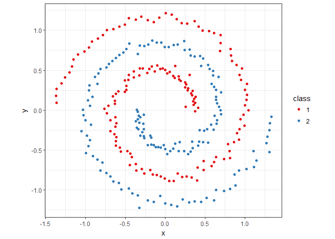
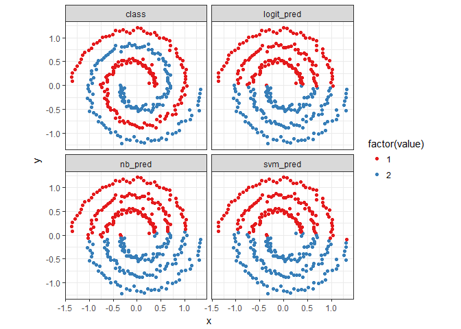
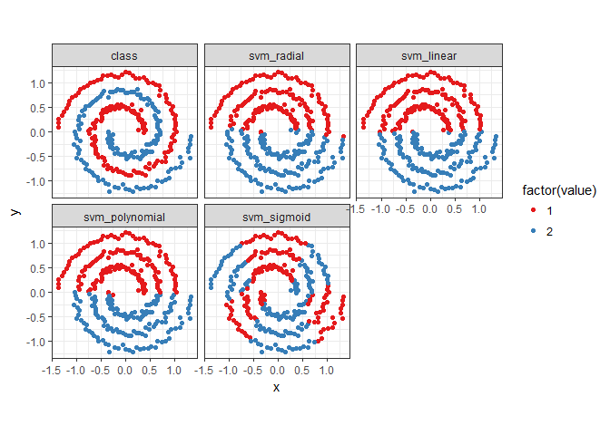
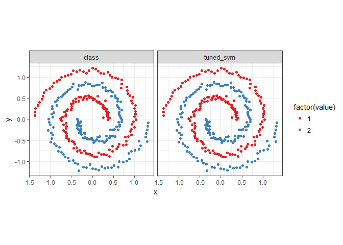

[Model Comparison](https://github.com/MNoorFawi/Model-Comparison)
================

finding a good model isn't always the main problem, sometimes there're other models that can give better results or we already have many. so comparing models is of big use in such cases.

#### Here we're going to apply and compare between some classification machine learning models to get the best one among them.

first we get the *spiral* data from the *kernlab* package and plot it

``` r
library(kernlab)
data('spirals')
s <- specc(spirals, centers = 2)
spiral_data <- data.frame(x = spirals[,1], y = spirals[,2],
                class = as.factor(s))

library(ggplot2)
ggplot(data = spiral_data) +
  geom_point(aes(x = x, y = y, color = class)) +
  coord_fixed() + theme_bw() + 
  scale_color_brewer(palette = 'Set1')
```

 then we're going to fit some algorithms on data and compare between them. how accurately they fitted the model, calculating the accuracy of each model and the AUC and visualizing the models.

#### the algorithms we'll fit are **Logistic Regression**, **Naive Bayes** and **Support Vector Machine**.

let's first define a function that gets AUC and the accuracy of each model.

``` r
library(ROCR)

accuracy <- function(model, outcome){
  mean(model == outcome)
}

auc <- function(model, outcome) { 
  per <- performance(prediction(model, outcome == 2),
                      "auc")
  as.numeric(per@y.values)
}
```

now we fit the models

``` r
# Logistic Regression
logit <- glm(class ~ x + y,
                 family = binomial(link = 'logit'),
                 data = spiral_data)
spiral_data$logit_pred <- ifelse(predict(logit) > 0, 2, 1)
accuracy(spiral_data$logit_pred, spiral_data$class)
```

    ## [1] 0.6633333

``` r
auc(spiral_data$logit_pred, spiral_data$class)
```

    ## [1] 0.6633333

``` r
# Naive Bayes
library(e1071)
nb <- naiveBayes(class ~ x + y, data = spiral_data)
spiral_data$nb_pred <- ifelse(
  predict(nb, newdata = spiral_data) == 2, 2, 1)
accuracy(spiral_data$nb_pred, spiral_data$class)
```

    ## [1] 0.6533333

``` r
auc(spiral_data$nb_pred, spiral_data$class)
```

    ## [1] 0.6533333

``` r
# SVM
svm_fit <- svm(class ~ x + y, data = spiral_data)
spiral_data$svm_pred <- ifelse(predict(svm_fit) == 2, 2, 1)
accuracy(spiral_data$svm_pred, spiral_data$class)
```

    ## [1] 0.6566667

``` r
auc(spiral_data$svm_pred, spiral_data$class)
```

    ## [1] 0.6566667

### Accuracy and AUC can sometimes be equal but they are two different measures ...

comparing the models visually on data.
--------------------------------------

``` r
### ON DATA 
predictions <- melt(spiral_data, id.vars = c('x', 'y'))
ggplot(predictions, aes(x = x, y = y, color = factor(value))) +
  geom_point() + coord_fixed() +
  scale_colour_brewer(palette = 'Set1') +
  facet_wrap(~ variable) + theme_bw()
```



seems we don't have a good model yet. but since the problem is nonlinear, *SVM* may perform better than the other two with some adjusting to its parameters.

also **DECISION TREE** or **K-NEAREST NEIGHBORS** can perform very well in this problem

``` r
### decision tree
library(rpart)
tree <- rpart(class ~ x + y, data = spiral_data)
prediction <- predict(tree, newdata = spiral_data, type = 'class')

### knn
library(class)
knn15 <- knn(train = spiral_data[, 1:2], test = spiral_data[, 1:2], 
             spiral_data$class, k = 15)
```

but we will go with **Support Vector Machine** for now

first we compare between its four kernels to choose the best one of them.

``` r
spiral_data <- spiral_data[, 1:3]
# radial
radial <- svm(class ~ x + y, data = spiral_data, kernel = 'radial')
spiral_data$svm_radial <- ifelse(predict(radial) == 2, 2, 1)
# linear
linear <- svm(class ~ x + y, data = spiral_data, kernel = 'linear')
spiral_data$svm_linear <- ifelse(predict(linear) == 2, 2, 1)
# polynomial
polynomial <- svm(class ~ x + y,
                  data = spiral_data, kernel = 'polynomial')
spiral_data$svm_polynomial <- ifelse(predict(polynomial) == 2, 2, 1)
# sigmoid
sigmoid <- svm(class ~ x + y, data = spiral_data, kernel = 'sigmoid')
spiral_data$svm_sigmoid <- ifelse(predict(sigmoid) == 2, 2, 1)

for(i in 4:7){
  print(names(spiral_data)[i])
  print(accuracy(spiral_data[, i], spiral_data$class))
}
```

    ## [1] "svm_radial"
    ## [1] 0.6566667
    ## [1] "svm_linear"
    ## [1] 0.66
    ## [1] "svm_polynomial"
    ## [1] 0.66
    ## [1] "svm_sigmoid"
    ## [1] 0.5566667

``` r
### plotting them
predictions <- melt(spiral_data, id.vars = c('x', 'y'))
ggplot(predictions, aes(x = x, y = y, color = factor(value))) +
  geom_point() + coord_fixed() +
  scale_colour_brewer(palette = 'Set1') +
  facet_wrap(~ variable) + theme_bw()
```



all almost give same results, but we'll go with the radial kernel **tuning** its parameters.

``` r
tuned_svm_radial <- tune.svm(class ~ x + y, data = spiral_data,
                      kernel = "radial", 
                  gamma = seq(0.2, 2, 0.2), 
                  cost = c(2 ^ (2:9), 10 ^ (-3:1)))
tuned_svm_radial$best.parameters
```

    ##   gamma cost
    ## 8   1.6    4

``` r
spiral_data <- spiral_data[, 1:3]

tuned_model <- svm(class ~ x + y, data = spiral_data,
                   kernel = 'radial', 
                   gamma = tuned_svm_radial$best.parameters[1],
                   cost = tuned_svm_radial$best.parameters[2])
spiral_data$tuned_svm <- ifelse(predict(tuned_model) == 2, 2, 1)

predictions <- melt(spiral_data, id.vars = c('x', 'y'))
ggplot(predictions, aes(x = x, y = y, color = factor(value))) +
  geom_point() + coord_fixed() +
  scale_colour_brewer(palette = 'Set1') +
  facet_wrap(~ variable) + theme_bw()
```



``` r
accuracy(spiral_data$tuned_svm, spiral_data$class)
```

    ## [1] 1

``` r
auc(spiral_data$tuned_svm, spiral_data$class)
```

    ## [1] 1

after comparing so many models, now we have a very fantastic model to use.
